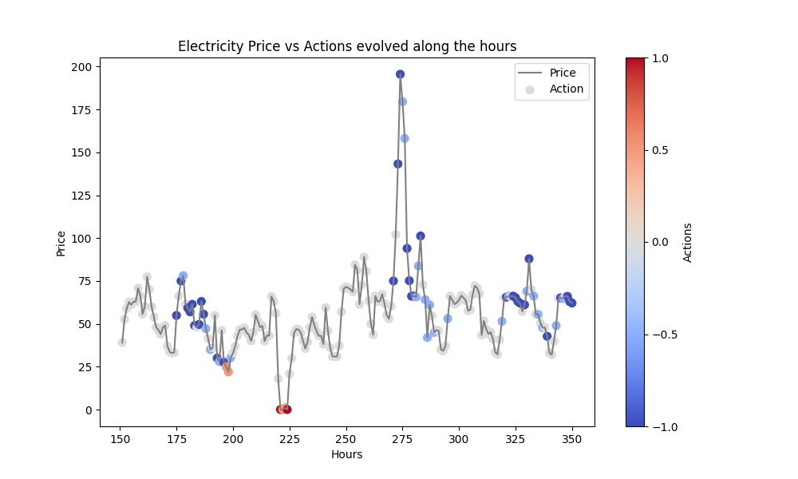

# Reinforcement Learning Project - Smart Grid

Instruction to run the code:

Install the library with the following command
1. conda create --name rl_env python=3.11.5
2. conda activate rl_env
3. cd Group13
4. pip install -r requirements.txt
5. python main.py

For test with different data:
python main.py --excel_file <file_path>

The config.json file is configuration for runing the code with customized combinations of settings, the default one in the config.json is the config we have the best performance, where the total reward is round -485 .

